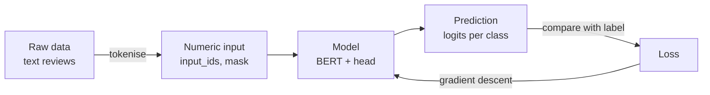
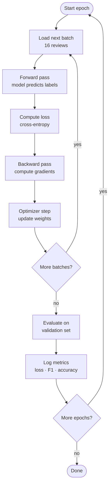
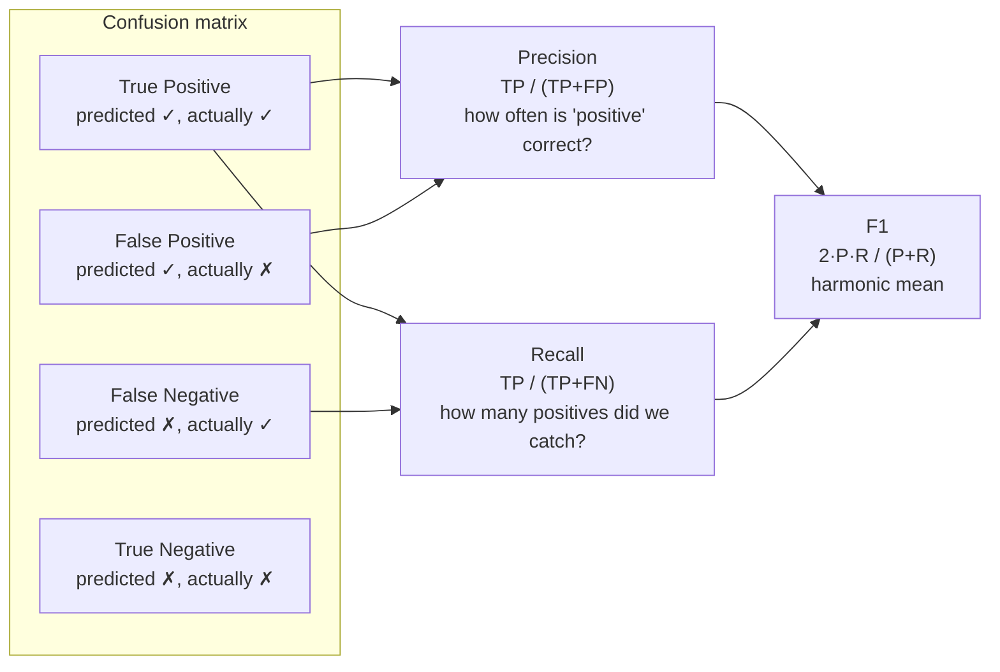
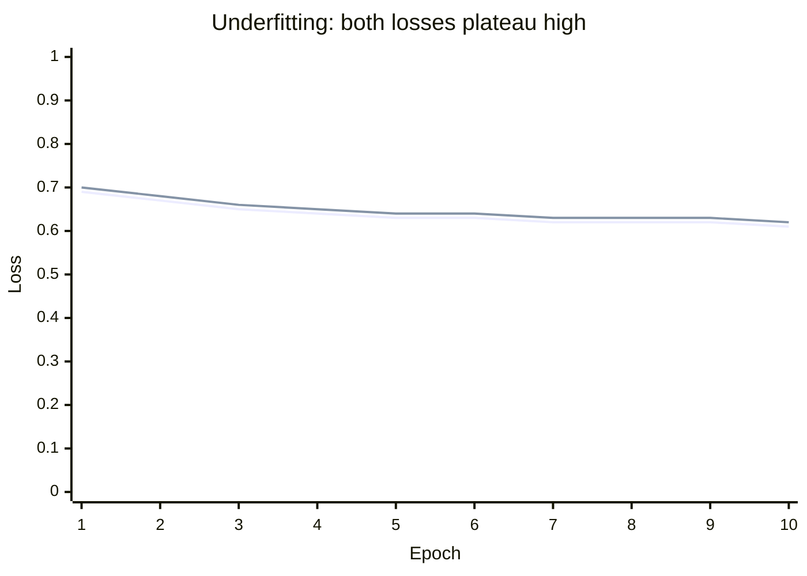
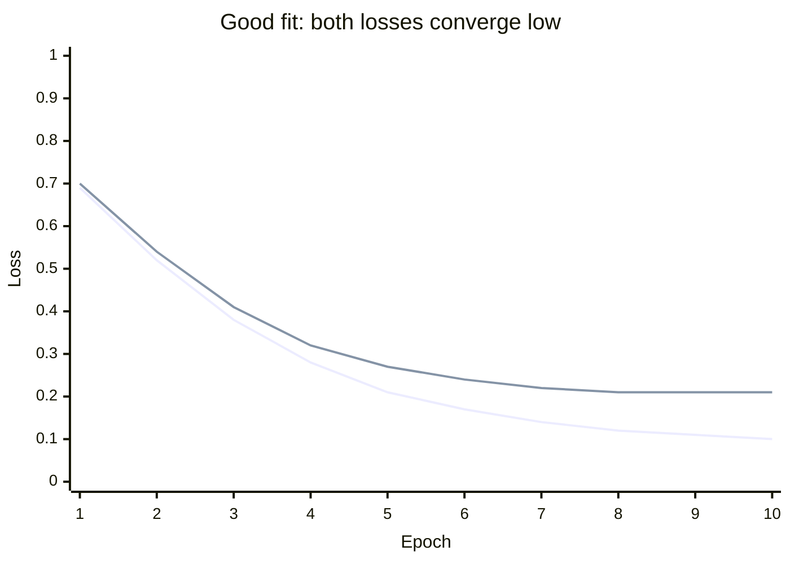
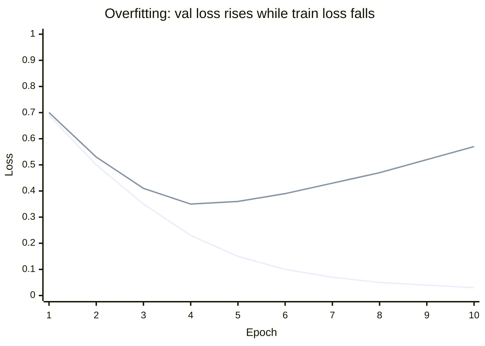
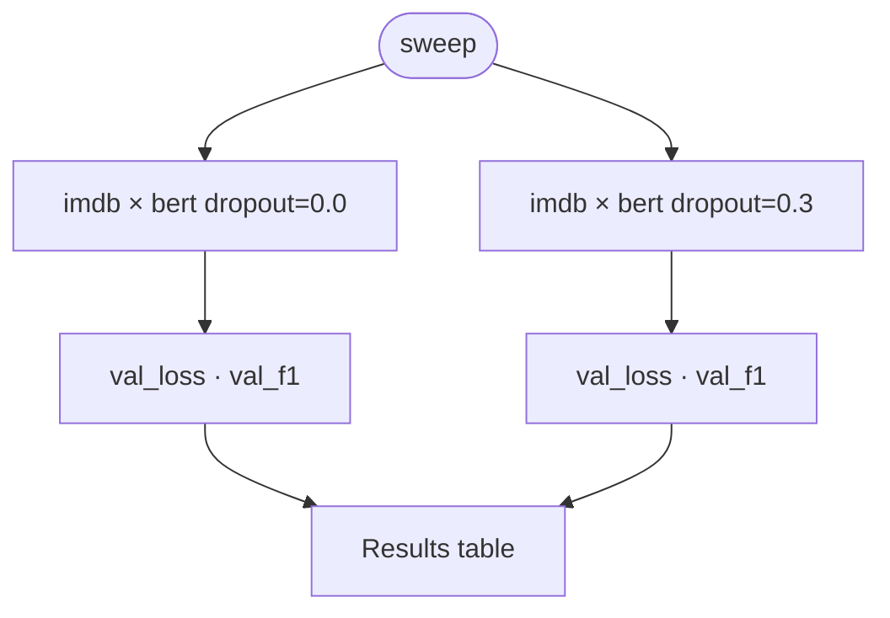

# A Crash Course in ML Training

This guide walks you through the full machine learning training cycle using a real example: a sentiment classifier trained on movie reviews. By the end you will know how to configure a model, run training, read the results, diagnose overfitting, and compare different configurations.

We use the **`bert_imdb`** starting point throughout — a [BERT](https://arxiv.org/abs/1810.04805)-based classifier for the [IMDB](https://huggingface.co/datasets/stanfordnlp/imdb) dataset (25 000 movie reviews labelled positive or negative).

---

## 1. The ML pipeline

Every supervised ML system reduces to the same loop:



- **Tokenisation** converts free text into integer sequences a neural network can process.
- The **model** maps those integers to a score (logit) for each class.
- The **loss** measures how wrong the prediction is. Lower is better.
- **Gradient descent** nudges the model's weights in the direction that reduces the loss.

Repeat for every example in the dataset and you have training.

---

## 2. Setting up

Generate a new project with the `bert_imdb` starting point:

```bash
cookiecutter https://github.com/tiagoft/mltemplate
# starting_point [template]: bert_imdb
```

Install:

```bash
cd my_classifier
uv pip install -e .
```

Open `src/configuration.toml`. The key fields are:

```toml
[training]
batch_size = 16      # reviews per gradient step
num_epochs = 3       # full passes over the training set
learning_rate = 2e-5 # how large each gradient step is

[[model]]
type = "bert"
bert_model_name = "bert-base-uncased"  # pretrained weights to load
num_classes = 2                         # positive / negative
dropout = 0.1

[[dataset]]
name = "imdb"
type = "bert_imdb"
bert_model_name = "bert-base-uncased"  # must match [[model]]
max_seq_len = 128                       # reviews longer than this are truncated
```

---

## 3. What the model does


BERT is a large pretrained language model. It has already read billions of words and learned rich representations of language. We load those pretrained weights and add only a small linear classification head on top. Fine-tuning means we continue training the whole stack — BERT included — on our task at a low learning rate so we don't destroy what BERT already knows.

---

## 4. The training loop



One **epoch** = one full pass over the training set. At the end of each epoch the model is evaluated on the **validation set** — examples it has never been trained on — so we can see whether it is actually learning to generalise.

---

## 5. Running training

```bash
my_classifier train
```

```text
Run directory: logs/my_classifier_log/20240601_143022
Epochs:   0%|          | 0/3
  Batches: 100%|████████| 1407/1407
  Saved checkpoint: checkpoint_epoch_1.pth
Epochs:  33%|███       | 1/3
  ...
Training complete.
```

Each epoch writes one line to `logs/my_classifier_log/20240601_143022/metrics.jsonl`:

```json
{"epoch": 1, "train_loss": 0.4821, "val_loss": 0.3102, "val_f1": 0.872, "val_accuracy": 0.873, "dataset": "imdb", "timestamp": "..."}
{"epoch": 2, "train_loss": 0.2934, "val_loss": 0.2731, "val_f1": 0.901, "val_accuracy": 0.902, "dataset": "imdb", "timestamp": "..."}
{"epoch": 3, "train_loss": 0.1876, "val_loss": 0.2619, "val_f1": 0.909, "val_accuracy": 0.910, "dataset": "imdb", "timestamp": "..."}
```

---

## 6. Visualising training curves

```bash
my_classifier viewer logs/my_classifier_log/20240601_143022/
# Saved: logs/my_classifier_log/20240601_143022/training_curve.png
```

The PNG shows **loss** on the left axis and **val F1** on the right axis, both over epochs. The two axes let you see both at the same scale without distortion.

You can also list all logged runs:

```bash
my_classifier viewer --list
```

```text
           Runs in logs/my_classifier_log
┏━━━━━━━━━━━━━━━━━━━━━┳━━━━━━━━━┳━━━━━━━━┳━━━━━━━━━━━━━━━━┳━━━━━━━━━━━━━━┓
┃ Run                 ┃ Dataset ┃ Epochs ┃ Final val_loss ┃ Final val_f1 ┃
┡━━━━━━━━━━━━━━━━━━━━━╇━━━━━━━━━╇━━━━━━━━╇━━━━━━━━━━━━━━━━╇━━━━━━━━━━━━━━┩
│ 20240601_143022     │ imdb    │      3 │         0.2619 │       0.9090 │
└─────────────────────┴─────────┴────────┴────────────────┴──────────────┘
```

---

## 7. Understanding loss, accuracy, and F1

### Loss (cross-entropy)

Loss measures how surprised the model is by the correct answer. A random classifier on 2 classes scores `ln(2) ≈ 0.693`. Lower than that means the model is learning.

### Accuracy

Fraction of examples classified correctly. Easy to understand, but misleading when classes are imbalanced (e.g. 90% of examples are positive — always predicting "positive" gives 90% accuracy for free).

### F1 score



**Macro F1** averages the per-class F1 scores. It treats every class equally regardless of size, making it robust to class imbalance. For IMDB (balanced: 50% positive / 50% negative) F1 and accuracy are nearly identical, but for imbalanced datasets F1 is the more honest number.

A model that trivially predicts the majority class has F1 ≈ 0 (precision is high but recall is zero for the minority class). A perfect model has F1 = 1.

---

## 8. Overfitting and underfitting

After training you will see one of three patterns in the loss curves.

### Underfitting — model is too simple or undertrained



Both train loss and val loss are high and close together. The model has not learned the task. Try: more epochs, higher learning rate, larger model.

### Good fit — model has learned and generalises



Train and val loss both decrease and stay close. This is what you want.

### Overfitting — model has memorised the training data



Train loss keeps falling but val loss turns around and rises. The model is memorising training examples rather than learning general patterns. Try: more dropout, fewer epochs (early stopping), smaller model, more training data.

The **checkpoint** from the epoch with the lowest val loss (not the final epoch) is the one to keep.

---

## 9. Comparing configurations with a sweep

Suppose you want to know whether dropout helps. Add a second `[[model]]` block to `src/configuration.toml`:

```toml
[[model]]
type = "bert"
bert_model_name = "bert-base-uncased"
num_classes = 2
dropout = 0.0          # no dropout

[[model]]
type = "bert"
bert_model_name = "bert-base-uncased"
num_classes = 2
dropout = 0.3          # higher dropout
```

The sweep trains every `[[model]] × [[dataset]]` combination:



```bash
my_classifier sweep
```

```text
Sweep directory: logs/my_classifier_log/sweep_20240601_150312  (2 variants)

Variant v00: imdb / bert
Epochs: 100%|████████| 3/3 ...

Variant v01: imdb / bert
Epochs: 100%|████████| 3/3 ...

         Sweep results: sweep_20240601_150312
┏━━━━━━━━━┳━━━━━━━━━┳━━━━━━━━┳━━━━━━━━━━━━━━━━┳━━━━━━━━━━━━━━┓
┃ Variant ┃ Dataset ┃ Model  ┃ Final val_loss ┃ Final val_f1 ┃
┡━━━━━━━━━╇━━━━━━━━━╇━━━━━━━━╇━━━━━━━━━━━━━━━━╇━━━━━━━━━━━━━━┩
│ v00     │ imdb    │ bert   │         0.2741 │       0.9021 │
│ v01     │ imdb    │ bert   │         0.2619 │       0.9090 │
└─────────┴─────────┴────────┴────────────────┴──────────────┘
```

Higher val F1 = better generalisation. Pick the variant with the best val F1 as your final model.

---

## 10. Reporting results

### Selecting the best model

Use val F1 to choose between configurations. Val F1 is computed on data the model never trained on, so it reflects how well the model will perform in practice.

```bash
my_classifier viewer --list
```

Pick the run (or sweep variant) with the highest `Final val_f1`.

### The test set

The validation set is used repeatedly (every epoch, every sweep variant) — which means it indirectly influences which model you pick. The **test set** is completely held out and never seen during training or model selection. It gives a final unbiased estimate of performance.

To evaluate on the test set, call `evaluate_all` from `src/eval.py` in a script:

```python
import tomllib, torch
from src.datasets import get_dataset, get_dataloaders
from src.models import _MODEL_REGISTRY
from src.eval import evaluate_all

with open("src/configuration.toml", "rb") as f:
    config = tomllib.load(f)

m_cfg = config["model"][0]
ds_cfg = config["dataset"][0]

device = torch.device("cuda" if torch.cuda.is_available() else "cpu")
_, val_ds, test_ds = get_dataset(ds_cfg)
_, val_loader, test_loader = get_dataloaders(val_ds, val_ds, test_ds, 32)

model = _MODEL_REGISTRY[m_cfg["type"]](**{k: v for k, v in m_cfg.items() if k != "type"})
model.load_state_dict(torch.load("path/to/checkpoint.pth", map_location=device))
model = model.to(device)

import torch.nn as nn
results = evaluate_all(model, val_loader, test_loader, nn.CrossEntropyLoss(), device)
print(results)
# {"val_loss": 0.262, "val_f1": 0.909, "val_accuracy": 0.910,
#  "test_loss": 0.271, "test_f1": 0.906, "test_accuracy": 0.907}
```

The number to report in a paper or presentation is **test F1**, not val F1.

> **Rule of thumb**: look at val metrics as much as you like during development; report test metrics exactly once at the very end.
